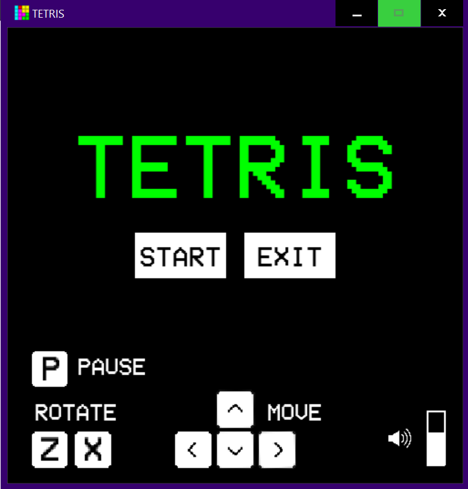
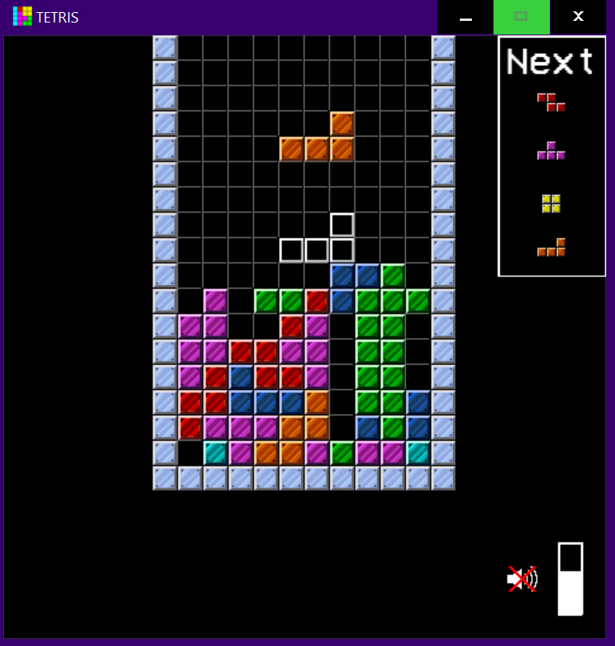
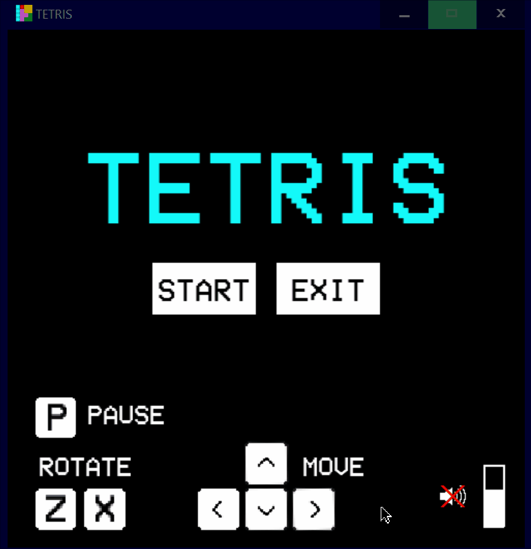

 # Tetris in python

This is a fully functioning Tetris clone with scoring, start menu, game over state and menu, sound effects, a game music track, the ability to mute all sound or change the volume and pause functionality. The start menu has start and exit buttons and explains the controlls. The game over menu has exit or restart buttons. In the game you also have a preview of
the next 4 pieces and increased difficulty based on rows cleared/score. This clone also uses the super rotation system for piece rotation.





## MVP

* The user can rotate and move shapes.
* Shapes are falling downwards
* Shapes land on top of eachother or on the floor
* All shapes from the classic tetris should be implemented
* If a row is filled with shapes, the row disappears
* The game is over if a shape lands such that some part of it is over the game board.


## Installation
This application requires python and pygame.  
To download python, visit https://www.python.org/downloads/  
To download pygame, use ```pip install pygame```

**Download:**
```git clone git@gits-15.sys.kth.se:jerikso/tetris-in-python.git```

**Install:**
```cd tetris-in-python```
```pip install .```

**Run:**
```python -m Tetris.src.game```

## Technologies
    Python 3
    Pygame
