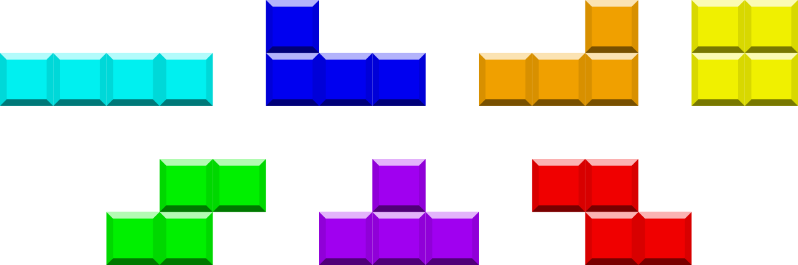

 # Tetris in python

This is a Tetris game built using python and pygame.   

## MVP

* The user can rotate and move shapes.
* Shapes are falling downwards
* Shapes land on top of eachother or on the floor
* All shapes from the classic tetris should be implemented

* If a row is filled with shapes, the row disappears
* The game is over if a shape lands such that some part of it is over the game board.

## Installation

Coming soon...

## Technologies
    Python 3
    Pygame
